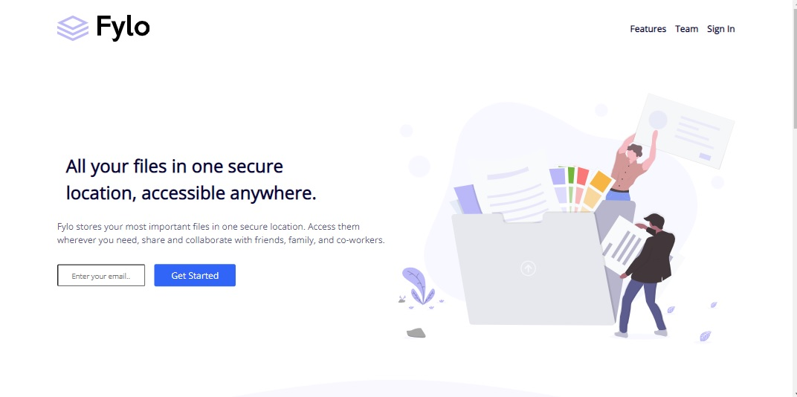

# Frontend Mentor - Fylo landing page with two column layout solution

This is a solution to the [Fylo landing page with two column layout challenge on Frontend Mentor](https://www.frontendmentor.io/challenges/fylo-landing-page-with-two-column-layout-5ca5ef041e82137ec91a50f5). Frontend Mentor challenges help you improve your coding skills by building realistic projects. 

## Table of contents

- [Overview](#overview)
  - [The challenge](#the-challenge)
  - [Screenshot](#screenshot)
  - [Links](#links)
- [My process](#my-process)
  - [Built with](#built-with)
  - [What I learned](#what-i-learned)
  - [Continued development](#continued-development)
  - [Useful resources](#useful-resources)
- [Author](#author)

## Overview

### The challenge

Users should be able to:

- View the optimal layout for the site depending on their device's screen size
- See hover states for all interactive elements on the page

### Screenshot

### Links

- Solution URL: [https://github.com/simplyJC/fylo-landing-page-with-two-column-layout-master](https://github.com/simplyJC/fylo-landing-page-with-two-column-layout-master)
- Live Site URL: [https://brave-lovelace-d420d0.netlify.app/](https://brave-lovelace-d420d0.netlify.app/)

## My process

### Built with

- Semantic HTML5 markup
- CSS custom properties
- Flexbox
- CSS Grid
- Mobile-first workflow

### What I learned

I learned how to apply flexbox in creating layout for  a page. Create a basic animation. Applying complicated background image layout. 

### Continued development
I planning to take for challenges in frontendmentor to further enhance my skills. 

### Useful resources

- [obiasahlin.com](https://tobiasahlin.com/blog/css-trick-animating-link-underlines/) - A great source for simple underline animation in links

- [Codepen.io](https://codepen.io/makshh/pen/RGgqGV) - Best resources for social media icons

## Author

- Website - [SimplyJC](https://www.simplyjc.com)
- Frontend Mentor - [@simplyJC](https://www.frontendmentor.io/profile/simplyJC)
- Twitter - [@jcaltamia](https://twitter.com/jcaltamia)

